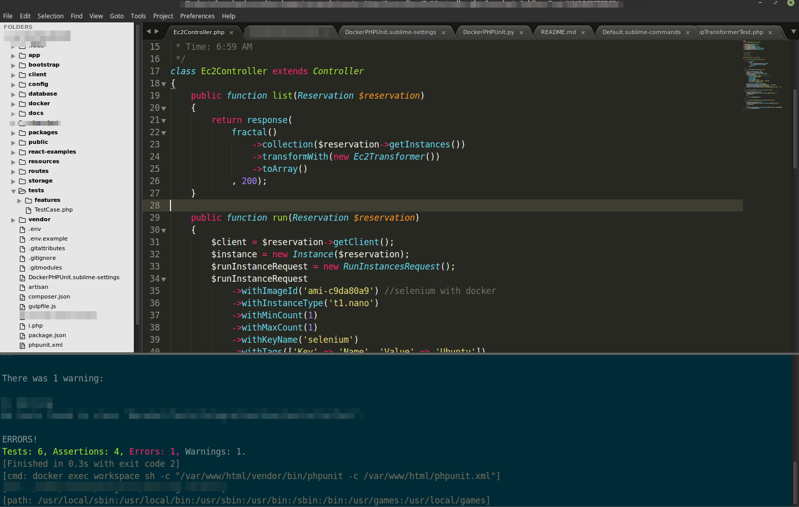

Docker PHPUnit commands
=======================

Originally forked from https://github.com/paza/RemotePHPUnit-for-Sublime-Text


This plugin allows you the run the PHPUnit on a remote server tests using the Sublime Text interface, without having to open and use the command line.

### Available commands:

- `Docker PHPUnit: Run all`
- `Docker PHPUnit: Run functional tests`
- `Docker PHPUnit: Run tests in current file`

### Colouring output



### Installation:
*Linux:*
Just git clone this repo in your ~/.config/sublime-text-3/Packages/

*OSX:*
Just git clone this repo in your  ~/Library/Application Support/Sublime Text 3/Packages

You may need to restart your IDE for your settings to take effect.

### Configuration:

Laravel 5.4 Test Example:

```json
{
	"phpunit_path": "/var/www/html/vendor/bin/phpunit", 
	"phpunit_xml_remote_path": "/var/www/html/phpunit.xml",
	"docker_container": "workspace",
	"phpunit_xml_local_path": ""
}
```
* phpunit_path: Path inside docker container
* phpunit_xml_remote_path: Path to phpunit.xml inside docker container
* phpunit_xml_local_path: This is the relative path to the PHPUnit config file (phpunit.xml or phpunit.xml.dist)


### Usage:
Press Cmd + Shift + P for the dropdown command list, search for `Docker PHPUnit: `, and pick your command. Also you can use `Tools/Docker PHPUnit` menu item

### Notes:
- PHPUnit config file needs to been in the root folder of your structure in the sidebar.
- You need insert in Sublime Text user settings `"show_panel_on_build": true` or use `Tools/Build Results/Show Build Results` menu item for view results.

### Key bindigns
```json
{ "keys": [",", "p"], "command": "docker_php_unit", "args": {"type": "current_file"}},
{ "keys": [",", "m"], "command": "docker_php_unit", "args": {"type": "functional"}},
{ "keys": [",", "t"], "command": "docker_php_unit"},
````